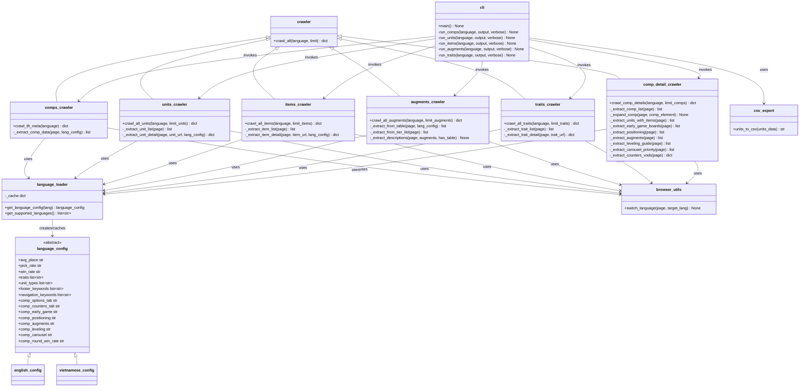

# Domain Model: Crawler

## Overview

The Crawler domain handles extraction of TFT meta data from MetaTFT.com using browser automation (Playwright).

## Class Diagram



## Entity Descriptions

### Crawlers

| Entity | Responsibility | Data Extracted |
|--------|---------------|----------------|
| `comps_crawler` | Extract team compositions | Comp names, units, items, win/pick/top4 rates |
| `units_crawler` | Extract unit details | Stats, abilities, builds, items, traits, positioning |
| `items_crawler` | Extract item details | Name, stats (AD/AP/AS/etc.), trait number, description |
| `augments_crawler` | Extract augment details | Name, tier (S/A/B/C/D), type, description |
| `traits_crawler` | Extract trait details | Name, ability description |
| `comp_detail_crawler` | Extract detailed comp data | Units with items, early game boards, positioning, augments, leveling guide, carousel priority, counters/VODs |

### Language System

| Entity | Responsibility |
|--------|---------------|
| `language_config` | Abstract base defining 30+ language-specific attributes |
| `english_config` | English labels, keywords, traits |
| `vietnamese_config` | Vietnamese labels + English fallbacks for page matching |
| `language_loader` | Factory with caching, case-insensitive lookup |

### Utilities

| Entity | Responsibility |
|--------|---------------|
| `browser_utils` | Playwright language switching via DOM selector |
| `csv_export` | Convert unit JSON data to CSV format |
| `cli` | Command-line interface with argparse |

## Standard Output Format

All crawlers return:

```json
{
  "timestamp": "ISO-8601",
  "source": "https://www.metatft.com/{endpoint}",
  "language": "en|vi",
  "total_{type}_found": N,
  "total_{type}_crawled": N,
  "{type}": [...]
}
```

## Business Rules

| ID | Rule | Applies To |
|----|------|-----------|
| BR-01 | Never hardcode language strings in crawler code | All crawlers |
| BR-02 | All crawlers must support `language` and `limit` parameters | All crawlers |
| BR-03 | Language config must be passed to JavaScript via `page.evaluate()` | All crawlers |
| BR-04 | Adding a new language requires only a new config file + loader update | Language system |
| BR-05 | Crawlers must handle page structure differences between languages | All crawlers |
| BR-06 | Description extraction must achieve >95% success rate | Items, augments, traits |
