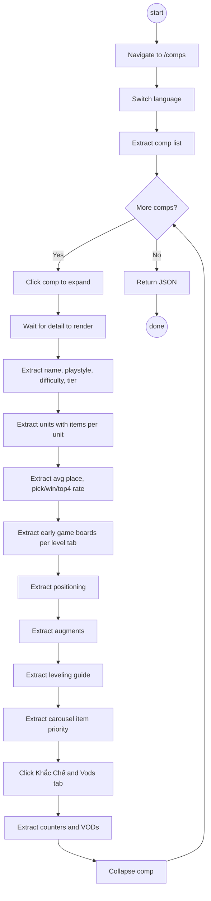

# DUC-CRAWLER-CRAWL-COMP-DETAIL: Crawl Comp Detail

## Summary

Extract detailed composition data from MetaTFT.com/comps by expanding each comp's detail view. Extracts items per unit, early game boards at multiple levels, positioning, leveling guide, augments, carousel item priority, and counters/VODs.

## Actors

| Actor | Role |
|-------|------|
| User | Invokes crawler via CLI or API |
| MetaTFT.com | Data source (JavaScript-rendered, click-to-expand) |
| Playwright | Browser automation for page interaction |

## Preconditions

- Playwright Chromium installed
- MetaTFT.com accessible

## Source URL

`https://www.metatft.com/comps#TFT16_{trait}-TFT16_{carry}`

## API

```python
async def crawl_comp_details(
    language: str = "vi",
    limit_comps: int = None,
) -> Dict[str, Any]
```

## Flow



## Acceptance Criteria

| ID | Criteria |
|----|---------|
| AC-01 | Extracts comp name, playstyle, difficulty, tier (S/A/B/C/D) |
| AC-02 | Extracts units list with **items per unit** (from img alt attributes) |
| AC-03 | Extracts stats: avg place, pick rate, win rate, top 4 rate |
| AC-04 | Extracts **early game boards** under each level sub-tab (Đầu Trận, Cấp 7-10), each with unit list + round win rate |
| AC-05 | Extracts **positioning** (ordered unit names from "Bài Trí Đội Hình") |
| AC-06 | Extracts **augments** (from img alt near "Nâng Cấp" section) |
| AC-07 | Extracts **leveling guide** with timing and gold (from "Lên Cấp" section) |
| AC-08 | Extracts **carousel/item component priority** with xN counts |
| AC-09 | Extracts **Khắc Chế & Vods** tab content (counters and VOD links) |
| AC-10 | Supports `limit_comps` parameter |
| AC-11 | Supports Vietnamese language |

## Sections NOT Needed

| Section | Vietnamese Label | Reason |
|---------|-----------------|--------|
| "Tướng & Trang Bị" tab | Champions & Items | Not requested |
| "Tộc/Hệ & Số Liệu" tab | Traits & Stats | Not requested |
| Level distribution | % at each level | Not requested |
| Pro Tips | Pro Tips | Not requested |

## Business Rules

| ID | Rule |
|----|------|
| BR-01 | Uses language config for all labels (not hardcoded) |
| BR-02 | Comps expand inline on click (no page navigation) |
| BR-03 | Must wait for detail content to render after click |
| BR-04 | Items per unit extracted from HTML img alt attributes |
| BR-05 | Augments extracted from img alt near "Nâng Cấp" container |
| BR-06 | Early game boards require clicking sub-tabs (Đầu Trận, Cấp 7-10) |
| BR-07 | Detail section ends at next tier marker (S/A/B/C/D) + comp name |

## Exception Flows

| ID | Condition | Action |
|----|-----------|--------|
| EF-01 | Comp detail fails to expand | Skip, log warning, continue |
| EF-02 | Page timeout | Retry once, then skip |
| EF-03 | Missing section (augments/positioning/etc.) | Return empty for that field |
| EF-04 | Tab click fails (Khắc Chế) | Return empty counters |

## Output Format

```json
{
  "timestamp": "ISO-8601",
  "source": "https://www.metatft.com/comps",
  "language": "vi",
  "total_comps_found": N,
  "total_comps_crawled": N,
  "comps": [
    {
      "name": "Warwick Zaun",
      "playstyle": "Cơ Bản",
      "difficulty": "Dễ",
      "tier": "S",
      "units": [
        {"name": "Warwick", "items": ["Ấn Xạ Thủ", "Huyết Kiếm", "Quyền Năng Khổng Lồ"]},
        {"name": "Ngộ Không", "items": ["Ấn Zaun", "Áo Choàng Lửa", "Giáp Máu Warmog"]},
        {"name": "Jinx", "items": []},
        ...
      ],
      "trait_counts": [5, 2, 2, 2, 2, 1, 1, 1],
      "stats": {
        "avg_place": 3.77,
        "pick_rate": 0.12,
        "win_rate": "13.4%",
        "top_4_rate": "66.0%"
      },
      "early_game_boards": [
        {
          "level": "Cấp 4",
          "units": ["Blitzcrank", "Caitlyn", "Ekko", "Vi"],
          "round_win_rate": "51.1%"
        },
        {
          "level": "Cấp 5",
          "units": ["Blitzcrank", "Ekko", "Vi", "Dr. Mundo", "Jinx"],
          "round_win_rate": "61.6%"
        }
      ],
      "positioning": ["Warwick", "Ngộ Không", "Dr. Mundo", "Shyvana", "Singed", "Jinx", "Kindred", "Ziggs", "Lucian & Senna"],
      "augments": ["Kho Báu Chôn Giấu", "Tất Tay Bậc Đồng II", "Tất Tay Bậc Đồng I", "Sảnh Đông Đúc"],
      "leveling_guide": [
        {"level": "Cấp 4", "timing": "2-1", "gold": null},
        {"level": "Cấp 5", "timing": "2-6", "gold": null},
        {"level": "Cấp 7", "timing": "3-6", "gold": 14.8},
        {"level": "Cấp 8", "timing": "4-5", "gold": 15.5}
      ],
      "carousel_priority": [
        {"component": "Recurve Bow", "count": 4},
        {"component": "Giant's Belt", "count": 3},
        {"component": "Sparring Gloves", "count": 3}
      ],
      "counters_and_vods": {
        "counters": [...],
        "vods": [...]
      }
    }
  ]
}
```

## Related Use Cases

- [DUC-CRAWLER-CRAWL-COMPS](crawl-comps.md) — Basic comp listing
- [DUC-LANGCONFIG-MANAGE](../language-config/manage-languages.md) — Language support

## Language Config Attributes Needed

New attributes to add to `languages/base.py`, `en.py`, `vi.py`:

| Attribute | English | Vietnamese |
|-----------|---------|------------|
| `comp_options_tab` | "Options & Quick Guide" | "Tùy Chọn & Hướng Dẫn Nhanh" |
| `comp_counters_tab` | "Counters & Vods" | "Khắc Chế & Vods" |
| `comp_early_game` | "Early Game" | "Đầu Trận" |
| `comp_positioning` | "Team Positioning" | "Bài Trí Đội Hình" |
| `comp_augments` | "Augments" | "Nâng Cấp" |
| `comp_leveling` | "Leveling" | "Lên Cấp" |
| `comp_carousel` | "Carousel Priority" | "Ưu Tiên Vòng Đi Chợ" |
| `comp_round_win_rate` | "Round Win Rate" | "Tỷ Lệ Thắng Vòng Đấu" |
